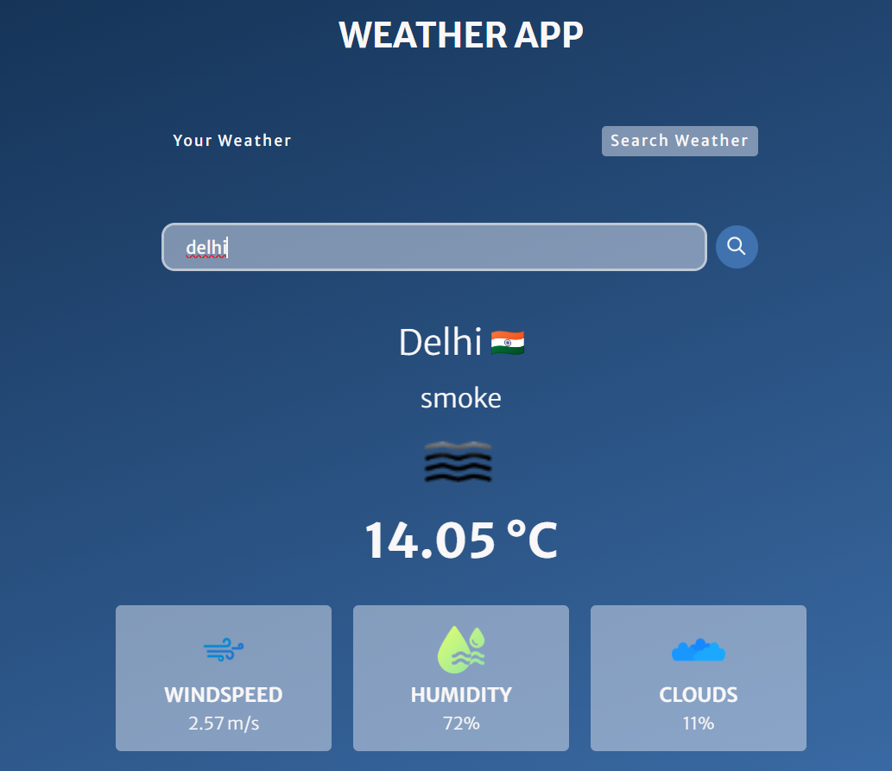
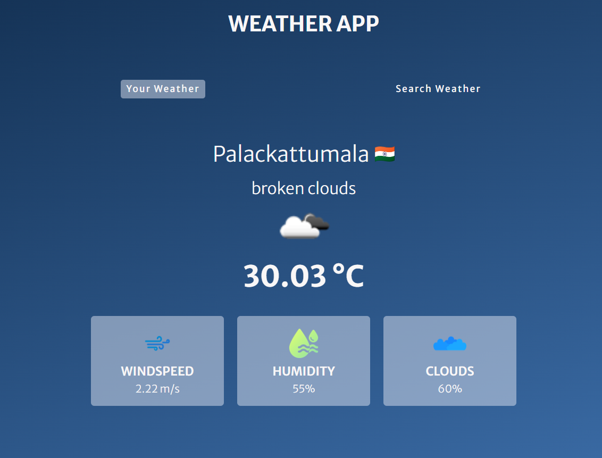

# Weatherapp
# Search Weather Of Any Location
:rocket: [Link to website][https://studynotion-frontend.vercel.app/]

## Introduction
Weatherapp is a comprehensive weather application developed using HTML, CSS, and JavaScript, offering users detailed insights into weather conditions, including temperature, humidity, rain predictions, and wind speed. Utilizing the power of the OpenWeatherMap API, Weatherify provides accurate and up-to-date weather information for any location.

## System Architecture

Weatherapp system architecture is designed to ensure efficiency and responsiveness. The front-end is built using HTML and CSS, creating an intuitive and visually appealing user interface. JavaScript is employed for dynamic content and seamless interaction. The back-end relies on the OpenWeatherMap API to fetch weather data, while the database manages user preferences and historical weather information.

### Front-end

The front-end of Weatherapp is crafted with a user-centric approach. It features an easy-to-navigate interface where users can input a location to retrieve detailed weather information. The design is not only aesthetically pleasing but also responsive, ensuring a seamless experience across various devices.

### Back-end
he back-end of Weather-app is powered by the OpenWeatherMap API, which enables the application to fetch real-time weather data for any specified location. The integration is handled through JavaScript, allowing for asynchronous requests and ensuring that users receive the most accurate and up-to-date weather information.

### Database

Weather-app utilizes a minimalistic database to store user preferences and historical weather information. While the primary focus is on real-time data retrieval, the database enhances the user experience by providing personalized settings and the ability to review past weather conditions.

## API Design

Weatherapp API design is centered around the OpenWeatherMap API, which facilitates seamless communication between the application and the weather data source. The API requests are structured to retrieve specific weather parameters, including temperature, humidity, rain predictions, and wind speed, ensuring a comprehensive overview of the current weather conditions.

